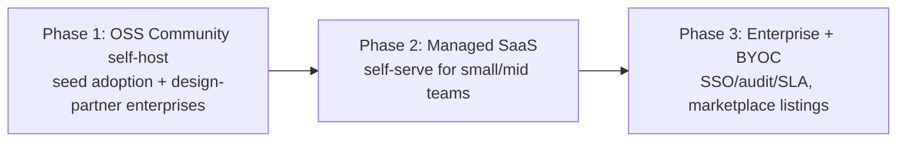

# AI Gateway — Deployment Models & Go-to-Market

> **Status:** Draft v1
> **Related:** [`system-design.md`](./system-design.md) · [`litellm-evaluation.md`](./litellm-evaluation.md)

How we ship and sell AI Gateway. The technical *how it runs* lives in the system design (§10, §12); this doc covers **how customers get it, in what editions, under what license, and at what price.**

---

## 1. TL;DR recommendation

**Lead with a self-hostable / downloadable product, offered as open-core, and add managed SaaS as a second track.**

The product's whole pitch — on-prem / 私有雲, data sovereignty, ISO 27001 / 27701, BYOK, keeping request data inside the customer boundary — is a **self-hosted story first**. That is also our sharpest differentiator versus pure-SaaS gateways. So:

1. **Self-hosted (downloadable)** is the flagship: Docker Compose + Helm, runs entirely in the customer's environment. Free **Community** edition to seed adoption; paid **Enterprise** edition for SSO, advanced audit/guardrails, and support/SLA.
2. **Managed SaaS** is the low-friction on-ramp for smaller teams who don't want to run infra — same product, we operate it.
3. **Dedicated / BYOC** (single-tenant in the customer's cloud, we manage it) bridges the two for regulated enterprises that want isolation *and* a managed service.

This "open-core + two delivery tracks" model is exactly how comparable infra products (and LiteLLM itself) monetize, and it fits the existing positioning ("測試中" / enterprise model entry point) rather than a bare proxy.

---

## 2. Two independent axes

Deployment isn't one choice — it's **where it runs** × **how it's licensed**. Keep them separate:

- **Where it runs:** Managed SaaS · Dedicated/BYOC · Self-hosted (downloadable).
- **How it's licensed:** Community (free, OSS/source-available) · Team · Enterprise.

The same codebase serves all of them (that's why the local-first, SQLite-default, Compose+Helm design in the system doc matters — one artifact, many targets).

---

## 3. Delivery models

### 3.1 Managed SaaS (multi-tenant)
We host it; customers sign up and get a hosted endpoint + console.

- **Pros:** zero customer ops, fastest time-to-value, continuous updates, best margin, easiest self-serve motion.
- **Cons:** their prompt/response data transits our infra → hard blocker for the compliance/私有雲 segment; we own uptime, tenant isolation, and scaling; multi-tenant security is a real burden.
- **Best for:** startups, small/mid teams, developers evaluating.

### 3.2 Dedicated / BYOC (single-tenant, we manage)
One isolated stack per customer, deployed **into the customer's own cloud account/VPC** (or a dedicated tenant in ours), operated by us.

- **Pros:** data stays in the customer's boundary (residency ✔), strong isolation, still a managed experience; premium price point.
- **Cons:** higher ops cost per customer, provisioning/upgrade automation required, cloud-account access negotiations.
- **Best for:** regulated enterprises that want isolation *and* don't want to run it themselves. Deliver via cloud marketplace (AWS/Azure/GCP) or Terraform into their account.

### 3.3 Self-hosted / downloadable (customer-run)
Customer downloads and runs it entirely themselves (on-prem or their private cloud). This is the flagship.

- **Pros:** full data sovereignty, air-gap capable, the direct answer to the ISO 27001/27701 + 私有雲 pitch; low marginal cost to us; OSS Community edition drives bottom-up adoption.
- **Cons:** we don't control their environment → support is harder; upgrades are their responsibility (mitigated by §6 tooling + the LiteLLM version matrix in system-design §11); harder to meter usage for billing (license-key based instead).
- **Best for:** enterprises with strict data/compliance requirements; the design-partner motion.

### 3.4 Comparison

| | Managed SaaS | Dedicated / BYOC | Self-hosted |
|---|---|---|---|
| Data residency | ✗ (our infra) | ✔ (customer cloud) | ✔✔ (fully theirs) |
| Customer ops burden | none | low | high |
| Time-to-value | fastest | medium | slower |
| Isolation | shared | single-tenant | single-tenant |
| Our margin | highest | medium | high (license) |
| Update delivery | continuous (us) | we push per-tenant | customer-pulled releases |
| Air-gap possible | ✗ | limited | ✔ |
| Fit for compliance segment | weak | strong | strongest |
| Metering/billing | usage-metered | usage-metered | license/subscription |

---

## 4. Editions (open-core)

Same codebase; features gate by license. This mirrors how LiteLLM itself splits OSS vs enterprise, and lets Community adoption feed the paid funnel.

| Capability | Community (free) | Team | Enterprise |
|---|---|---|---|
| Unified API, routing, fallback, virtual keys, BYOK | ✔ | ✔ | ✔ |
| Usage/cost tracking, budgets, basic dashboard | ✔ | ✔ | ✔ |
| Basic guardrails (regex/PII heuristics) | ✔ | ✔ | ✔ |
| SQLite + Postgres, Docker Compose + Helm | ✔ | ✔ | ✔ |
| Multi-team governance UI, rate cards, exports | — | ✔ | ✔ |
| Advanced guardrails (LLM-judge, moderation providers) | — | ✔ | ✔ |
| **SSO/SAML, SCIM** | — | — | ✔ |
| **Advanced audit / compliance evidence (ISO 27001/27701)** | — | — | ✔ |
| Air-gapped install, private-model registry | — | — | ✔ |
| Support + SLA, LTS releases | community | business hours | 24/7 + SLA |

> Deliberately, the enterprise-gated features (SSO/SAML, advanced audit) are the same ones LiteLLM puts behind *its* paid tier — but we implement them in **our** control plane, so we capture that value instead of paying upstream for it (system-design §13).

---

## 5. Licensing

- **LiteLLM is MIT** — we can embed and redistribute it freely (with attribution). No license fee owed upstream; we only consider their paid *support/enterprise* if it buys real leverage.
- **Our control plane** is the proprietary/commercial layer. Recommended structure:
  - **Community edition:** permissive OSS (e.g. Apache-2.0) *or* source-available (e.g. BSL/Elastic-style) — permissive maximizes adoption; source-available protects against a cloud provider reselling our managed service. Pick based on how worried we are about that.
  - **Team/Enterprise features:** commercial license, gated by a signed **license key** the app validates at startup (works offline / air-gapped).
- **Attribution & compliance:** ship an OSS notice file (LiteLLM MIT + transitive deps); run license scanning in CI.

---

## 6. Packaging & distribution

One build, multiple channels:

| Channel | For | Mechanics |
|---|---|---|
| **Docker images** (pinned by digest) | all self-hosted | published to a registry; Compose for small installs |
| **Helm chart** | k8s self-hosted / BYOC | versioned chart; values for SQLite-vs-Postgres, Redis, Vault |
| **Terraform module** | BYOC | provisions into customer cloud account |
| **Cloud marketplaces** (AWS/Azure/GCP) | BYOC / procurement | listing + metered or BYOL billing; eases enterprise purchasing |
| **Air-gapped bundle** | high-security enterprise | offline image bundle + license key, no phone-home |
| **License key service** | Team/Enterprise | offline-verifiable key unlocks gated features |

**Update delivery by model:** SaaS = continuous (we deploy); BYOC = we push per-tenant on a schedule; self-hosted = customer pulls **versioned releases** using the upgrade tooling and the **AI Gateway ↔ LiteLLM compatibility matrix** (system-design §11). Enterprise gets **LTS** lines with backported security fixes.

---

## 7. Pricing (directional)

Match the meter to the model:

- **Managed SaaS / BYOC (usage-metered):** platform fee per tier + usage component. Usage options: **% markup on provider spend**, **per-1M-tokens**, or **per-request**. A markup-on-spend model aligns our revenue with customer value and is simple to explain. Add per-seat for console users at higher tiers.
- **Self-hosted (subscription/license):** annual license priced by **throughput/nodes** (e.g. number of proxy replicas or RPS tier) and edition, since we can't meter their traffic directly. Enterprise adds support/SLA.
- **Community:** free — the adoption engine and top of the funnel.

Land-and-expand: free Community/self-host → paid Team when they need governance/exports → Enterprise when compliance/SSO/SLA is required.

---

## 8. Recommended GTM path (phased)

1. **Phase 1 — Community self-host + design partners.** Ship the free downloadable edition to build adoption and credibility; land 2–3 enterprise design partners who need the 私有雲/compliance story (this is where our differentiation is strongest and matches the current "測試中" enterprise entry point).
2. **Phase 2 — Managed SaaS.** Open a hosted, self-serve track for teams that don't want infra — the low-friction revenue on-ramp.
3. **Phase 3 — Enterprise + BYOC.** Formalize Enterprise edition (SSO/SAML, advanced audit, LTS, SLA), dedicated/BYOC deployment, and cloud-marketplace listings for procurement.

---

## 9. Risks & considerations

| Risk | Note / mitigation |
|---|---|
| Supporting many deploy targets is expensive | One codebase, local-first design (SQLite/Compose/Helm) keeps the matrix small; automate BYOC provisioning |
| Multi-tenant SaaS isolation | Hard security surface — invest early or lead with self-host/BYOC where isolation is inherent |
| Open-core boundary disputes | Decide the Community-vs-paid feature line up front and hold it; document it publicly |
| Cloud provider reselling our SaaS | Choose source-available (BSL) for Community if this is a real threat |
| Self-hosted support cost | Versioned releases + upgrade tooling + compatibility matrix (system-design §11); tier support by edition |
| Metering self-hosted usage | License-key + optional (opt-in) telemetry; price by throughput/nodes, not tokens |
| LiteLLM MIT attribution / license compliance | Ship OSS notices; CI license scan |

---

## 10. Open questions

- Community license: permissive (Apache-2.0, max adoption) or source-available (BSL, anti-reselling)?
- Usage pricing primitive: % of provider spend vs per-token vs per-request?
- Do we invest in multi-tenant SaaS isolation now, or defer SaaS until after self-host/BYOC traction?
- Which cloud marketplace first (AWS vs Azure vs GCP) based on target-customer procurement?
