# AI Gateway — Implementation Plan

> **Status:** Draft v1
> **Related:** [`system-design.md`](./system-design.md) · [`litellm-evaluation.md`](./litellm-evaluation.md)

A test-driven, milestone-based plan to build the AI Gateway described in the system design. Optimized for a small team (1–2 backend + 1 frontend) and a **simple local dev loop**.

**Ground rules (from the stack decisions):**
- **Python + FastAPI**, managed with **uv** (single workspace lockfile).
- **SQLite** by default (SQLAlchemy + Alembic); Postgres is a connection-string swap for scale.
- **Vue 3 + Vite + TypeScript** for the admin UI.
- **TDD**: write a failing test first, make it pass, refactor. No production code without a test that required it.
- **Local-first**: `make dev` and `uv run pytest` require **no external services** (SQLite file/in-memory, in-process cache, stubbed providers).

---

## 1. Toolchain & Prerequisites

| Tool | Version | Purpose |
|---|---|---|
| Python | 3.12+ | Backend runtime |
| [uv](https://docs.astral.sh/uv/) | latest | Python env + deps + lockfile |
| Node.js | 20+ | Vue build tooling |
| pnpm | 9+ | Frontend package manager |
| Docker | latest | Compose deploy (not required for inner loop) |
| make | — | Task runner |

First-time setup:

```bash
uv sync                      # install all Python deps from uv.lock
uv run alembic upgrade head  # create local SQLite schema
uv run scripts/seed.py       # demo org/team/key/model
cd admin-ui && pnpm install  # frontend deps
```

Everyday loop:

```bash
make dev        # governance-api + litellm proxy + vue, all hot-reloading
make test       # uv run pytest -q  (+ vitest for UI)
make lint       # ruff + mypy + eslint
```

---

## 2. TDD Workflow

**Red → Green → Refactor**, per unit of behavior:

1. **Red** — write the smallest failing test expressing the next behavior (`uv run pytest -k new_test` fails).
2. **Green** — write the minimum code to pass.
3. **Refactor** — clean up with tests green; commit.

**Test pyramid:**

| Layer | Scope | Tooling | Speed | When |
|---|---|---|---|---|
| **Unit** | Pure logic: policy/budget resolution, rating math, config compiler, guardrail rules | pytest | ms | Most tests live here |
| **API/integration** | FastAPI routes against **in-memory SQLite**, real DB layer, stubbed providers/secrets | pytest + httpx `AsyncClient` | 10s–100s ms | Every endpoint + hook |
| **End-to-end** | Boot governance-api + LiteLLM proxy + stub provider; drive a real `/v1/chat/completions` | pytest + subprocess/compose | seconds | Critical request path only |
| **Frontend** | Components + stores | vitest + Vue Test Utils | ms | Every component with logic |
| **Load** | Throughput/latency SLOs | k6/locust | minutes | Pre-hardening, in CI nightly |

**Key test enablers (build these in M0/M1 so TDD is fast):**
- `db` fixture → fresh in-memory SQLite + `create_all`, rolled back per test.
- `client` fixture → `AsyncClient` bound to the FastAPI app with dependency overrides.
- **Stub provider** → a fake LLM backend returning deterministic tokens + usage, so no network/keys in tests.
- **Fake secrets provider** and **in-process cache** used automatically under `pytest`.
- Factory helpers (`make_org`, `make_key`, …) for terse arrange steps.

**Coverage gate:** ≥ 85% on control-plane packages; 100% on rating/budget/policy resolution (money + access logic). Enforced in CI.

---

## 3. Milestones

Each milestone is independently shippable and ends **green** (all tests pass, lint clean, coverage gate met). Estimates assume the small team above.

### M0 — Bootstrap & CI  *(~3 days)*
Stand up the skeleton and the test harness first, so every later milestone is TDD from line one.

- uv workspace (`pyproject.toml` + members), `uv.lock`, `Makefile`, `.env.example`.
- `governance-api` FastAPI app with `/healthz` — **first test is `test_healthz`**.
- `db`, `client`, `stub_provider`, `fake_secrets` pytest fixtures.
- Alembic wired for SQLite; empty initial migration.
- CI (GitHub Actions): `uv sync`, `ruff`, `mypy`, `pytest --cov`, coverage gate; Vue lint+vitest.
- Vue app scaffolded (Vite + TS + Pinia + router) with a placeholder dashboard and one passing vitest.

**DoD:** `make dev` serves API + Vue; `make test` green in CI; coverage reporting live.

### M1 — Data model & migrations  *(~4 days)*
- SQLAlchemy models for all data-model entities (system-design §8): Org, Team, User, Membership, App, VirtualKey, ProviderCredential, ModelDeployment, Policy, Budget, UsageRecord, AuditEvent, RateCard.
- Alembic migration; verify it applies on **both** SQLite and Postgres (CI matrix).
- Repository layer + factory fixtures.
- **Tests first:** model constraints, cascade deletes, JSON-column round-trips, `scope_type` resolution helper (most-specific-wins) with exhaustive cases.

**DoD:** schema migrates on SQLite + Postgres; policy/budget resolution unit-tested to 100%.

### M2 — Governance API & RBAC  *(~1.5 wk)*
CRUD + auth for the org hierarchy — the control-plane heart.

- Endpoints: orgs, teams, users, memberships, apps.
- **Virtual key lifecycle**: issue (returns plaintext once), store hashed, scope (models/budget/limits/expiry), rotate, revoke.
- RBAC dependency (`org-admin`/`team-admin`/`developer`/`billing-viewer`/`auditor`) enforced per route.
- `AuditEvent` written for every mutating action.
- **Tests first per endpoint:** happy path, authz denied, validation errors, key hashing (plaintext never stored), audit row asserted.

**DoD:** full org→team→user→key management via API, RBAC + audit verified by tests.

### M3 — LiteLLM integration & config compiler  *(~1.5 wk)*
Wire the data plane to our source of truth.

- **Config compiler** (pure, heavily unit-tested): `ModelDeployment[] + Policy → LiteLLM config` (models, router strategy, fallbacks).
- **Custom-auth hook**: LiteLLM validates the incoming virtual key against our DB/cache (no LiteLLM key store).
- Hot-reload path: compile → write config → signal proxy.
- **E2E test**: seed a model→stub provider, call `/v1/chat/completions` through the proxy with a virtual key, assert a valid completion and that an unknown/expired key is rejected.

**DoD:** a real OpenAI-compatible request routes through LiteLLM using our keys/config; fallback to a second (stub) deployment verified.

### M4 — Metering, budgets & guardrails hooks  *(~1.5 wk)*
- **Metering hook**: capture tokens + compute cost (via RateCard) → write `UsageRecord`; async/non-blocking.
- **Budget/quota enforcement**: pre-call check against cached counters; soft (alert) vs hard (block); period reset.
- **Rate limiting**: RPM/TPM per key/team via cache (in-process locally, Redis in prod) — same interface both ways.
- **Guardrails v1**: PII detection/redaction + prompt-injection heuristic + output JSON-schema validation; per-policy fail-open/closed.
- **Tests first:** cost math exact to the cent; budget block at threshold; rate-limit 429 semantics; each guardrail rule (positive + negative).

**DoD:** over-budget and rate-limited requests are blocked; usage rows priced correctly; guardrails toggle per policy.

### M5 — Usage aggregation & billing API  *(~1 wk)*
- Aggregation queries (usage/cost by org/team/user/model/day) with SQLite-compatible SQL.
- Rate cards + markup; invoice/period rollups; CSV + webhook export.
- Budget-alert evaluation surfaced via API.
- **Tests first:** aggregation correctness on seeded fixtures; rating with markup; export format snapshot.

**DoD:** dashboard/billing endpoints return correct numbers; export verified.

### M6 — Vue Admin UI  *(~2 wk, overlaps M2–M5)*
- Typed API client generated from the FastAPI OpenAPI schema (single source of truth).
- Views: dashboard (usage/cost charts), keys (create/rotate/revoke), model registry (CRUD + routing), usage explorer, audit log, budgets/policies.
- Pinia stores; auth via OIDC (dev shim for local).
- **Tests first:** vitest for stores + logic-bearing components; MSW-mocked API.

**DoD:** an admin can do the full lifecycle (create model → issue key → see usage → set budget) from the UI locally.

### M7 — Local DX polish & seed  *(~2 days)*
- `make dev` one-command up; `scripts/seed.py` demo data; stub provider default so no real key needed.
- README quickstart; troubleshooting.
- **Test:** a smoke script asserting a clean clone → `make dev` → seeded request succeeds.

**DoD:** a new dev is productive in < 10 minutes with nothing but uv + Node.

### M8 — Deploy & hardening  *(~1.5 wk)*
- Docker images; Compose (SQLite-volume profile **and** Postgres+Redis+Vault profile).
- Helm chart for k8s; HPA on the proxy.
- Postgres migration path validated; secrets via Vault; OTel/Prometheus/Langfuse wired.
- Load tests to NFR targets; security review; runbooks.

**DoD:** deploys via Compose and Helm; passes load SLOs; Postgres path green.

---

## 4. Sequencing

```mermaid
gantt
    title Build sequence (small team)
    dateFormat X
    axisFormat %s
    section Backend
    M0 Bootstrap+CI        :m0, 0, 3d
    M1 Data model          :m1, after m0, 4d
    M2 Governance+RBAC     :m2, after m1, 8d
    M3 LiteLLM+compiler    :m3, after m2, 8d
    M4 Metering+guardrails :m4, after m3, 8d
    M5 Billing API         :m5, after m4, 5d
    section Frontend
    M6 Vue Admin UI        :m6, after m1, 14d
    section Ops
    M7 Local DX            :m7, after m5, 2d
    M8 Deploy+hardening    :m8, after m7, 8d
```



Critical path is M0→M1→M2→M3→M4→M5. The Vue UI (M6) starts once the data model/OpenAPI stabilize (after M1) and tracks endpoints as they land. **Target to credible v1: ~2–3 months**, matching the evaluation estimate.

---

## 5. CI/CD

- **PR checks:** ruff (lint+format), mypy, pytest with coverage gate, vitest, eslint. DB matrix: SQLite + Postgres.
- **Migration check:** `alembic upgrade head` then autogenerate must produce **no diff** (schema/model drift guard).
- **Contract check:** OpenAPI schema is committed; UI client regeneration must be clean (no drift).
- **LiteLLM pin guard:** an E2E smoke test runs against the pinned LiteLLM version; upgrades go through a dedicated PR.
- **Main branch:** build+push Docker images; deploy to staging; nightly load test.

---

## 6. Definition of Done (every feature)

- [ ] Failing test written first; behavior covered by unit + (if user-facing) API/integration tests.
- [ ] Coverage gate met (100% for money/access logic).
- [ ] Lint + type checks clean.
- [ ] Runs on SQLite locally with no external services.
- [ ] Audit event emitted if it mutates governance state.
- [ ] OpenAPI updated; UI client regenerates cleanly if API changed.
- [ ] Docs/README touched if behavior or setup changed.

---

## 7. Risks specific to this plan

| Risk | Mitigation |
|---|---|
| SQLite/Postgres SQL divergence (JSON ops, arrays, upserts) | Go through SQLAlchemy; CI runs the suite on **both** DBs; avoid raw dialect SQL |
| LiteLLM custom-auth/hook API changes between versions | Pin version; E2E smoke test guards the contract; isolate hook glue behind our interfaces |
| Guardrail latency on the hot path | Keep v1 guardrails cheap (heuristics/regex); make heavy checks async/sampled per policy |
| UI/API drift | OpenAPI is the single source; generated client + CI drift check |
| "Works locally, breaks at scale" (cache/counters) | Same interface for in-process and Redis; run a Redis-backed integration test in CI |

---

## 8. First week, concretely

1. `M0`: uv workspace + FastAPI `/healthz` + `test_healthz` (red→green). CI green.
2. Add `db`/`client`/`stub_provider` fixtures + first factory. Prove in-memory SQLite tests run in ms.
3. `M1`: model `Org`+`Team`+`VirtualKey` test-first; migration applies on SQLite + Postgres.
4. `scope_type` resolution unit tests (100%).
5. Scaffold Vue app + one passing vitest; wire `make dev`.

Everything after follows the milestone order, always test-first.
