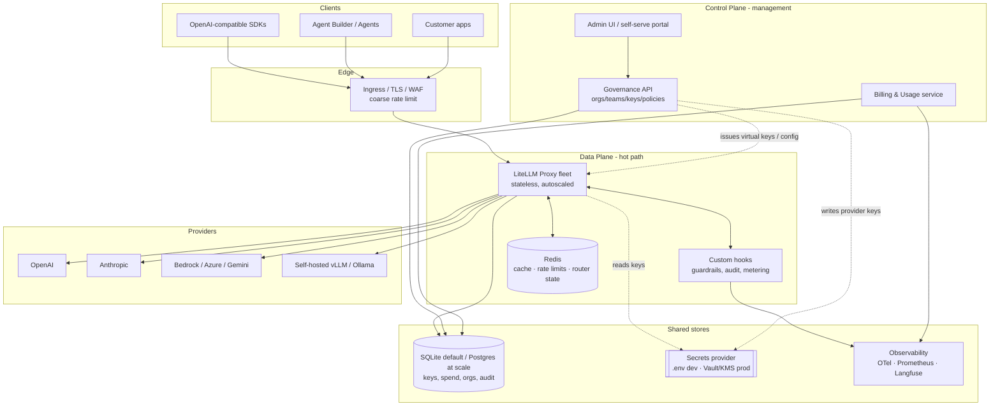
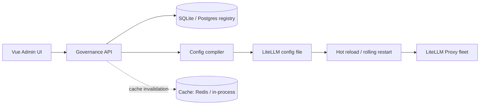

# AI Gateway — System Design

> **Status:** Draft v2
> **Author:** Platform team
> **Related:** [`litellm-evaluation.md`](./litellm-evaluation.md) · [`implementation-plan.md`](./implementation-plan.md)
>
> **Stack decisions (v2):** Backend **Python + FastAPI**, managed with **uv**; **SQLite** as the default datastore (Postgres optional at scale); frontend **Vue 3**; **test-driven development (TDD)** throughout; a **simple single-command local dev** path is a first-class requirement.

This document specifies the architecture for **AI Gateway**, a self-hostable enterprise LLM gateway built on top of **[LiteLLM Proxy](https://docs.litellm.ai/docs/simple_proxy)**. It follows the decision from the evaluation memo: *embed LiteLLM as the routing/adapter core (data plane) and build the product value one layer up (control plane) — org/team governance, billing, compliance/audit, and Agent Builder integration.*

---

## 1. Goals & Non-Goals

### 1.1 Product goals

- **One API, many providers** — a single OpenAI-compatible endpoint in front of OpenAI, Anthropic, Gemini, Bedrock, Azure, and self-hosted models (vLLM/Ollama).
- **BYOK & virtual keys** — customers bring their own provider keys; consumers get scoped virtual keys, never the real ones.
- **Unified usage & cost accounting** — every request is metered, priced, and attributable to an org/team/user/app.
- **Reliability** — automatic fallback and retry when a primary model/provider fails or degrades.
- **Governance** — org → team → user hierarchy, RBAC, budgets, quotas, rate limits.
- **Compliance-ready** — audit trail, data-residency controls, and on-prem/private-cloud deployment to support the ISO 27001 / 27701 story.
- **Extensible** — pluggable guardrails, logging sinks, and billing hooks; tight integration with Agent Builder / Agent 自動化系統.

### 1.2 Non-functional requirements

| Attribute | Target |
|---|---|
| Added latency (gateway overhead, excl. provider) | p50 < 15 ms, p99 < 60 ms |
| Availability | 99.9% (data plane), 99.5% (control plane) |
| Throughput | Horizontally scalable; 5k+ concurrent streams per proxy fleet |
| Streaming | First-token passthrough, no buffering of full response |
| Deployment | Single-command local dev; Docker Compose (small/on-prem); Kubernetes/Helm (scale) |
| Data residency | All request/response data can stay within a customer VPC/on-prem |
| Local dev | Runs on a laptop with **no external services** — SQLite file, in-process cache, stubbed providers |

### 1.3 Non-goals (v1)

- Training / fine-tuning orchestration (only inference + managed fine-tune passthrough where a provider supports it).
- Building our own inference runtime — we route to model servers, we don't serve weights.
- A general-purpose API management product — scope is LLM/agent traffic.

---

## 2. Architecture Overview

The system splits into a **data plane** (the request hot path, must be fast and highly available) and a **control plane** (management, governance, billing — can tolerate brief downtime without stopping inference).



### 2.1 Why this split

- **LiteLLM is the data plane, not the product.** We run it as stateless proxy replicas and extend it via its callback/hook system rather than forking it. Provider adapters, routing, retries, and virtual-key auth come for free and stay current with vendor API changes.
- **The control plane is our own service.** Governance, billing, RBAC/SSO, and the branded admin UI live in code we own, backed by our own schema. This is where product differentiation lives and where we avoid the "LiteLLM + a UI skin" trap called out in the evaluation.
- **The two planes share one datastore (SQLite by default, Postgres at scale) + an optional cache + a secrets provider** but have separate failure domains: if the control plane is down, in-flight inference keeps working from cached config.
- **Datastore is pluggable via SQLAlchemy.** SQLite (a single file) is the default — zero-ops for local dev and small on-prem installs; switch to Postgres for HA/scale by changing one connection string. We deliberately keep our own store as the source of truth for keys/spend (via LiteLLM custom-auth hooks) rather than depending on LiteLLM's Prisma/Postgres key store, so SQLite stays viable end-to-end.
- **The cache (Redis) is optional.** Locally it falls back to an in-process implementation so nothing external is required; in production Redis provides shared rate-limit counters and caching across proxy replicas.

---

## 3. Components

### 3.1 Edge / Ingress
- TLS termination, WAF, IP allow/deny, coarse global rate limiting, request-size limits.
- Options: Envoy / Traefik / nginx, or a cloud L7 LB. Kept dumb — no business logic.

### 3.2 LiteLLM Proxy fleet (data plane core)
- Stateless replicas behind the ingress; scale on CPU + concurrent-request metrics.
- Responsibilities: OpenAI-compatible surface, provider adapters, router (fallback/retry/load-balance), virtual-key auth, native spend logging.
- Configuration is **generated** from the control-plane DB (see §7), not hand-edited YAML in production.

### 3.3 Custom hooks (our code, in the proxy process)
Implemented as LiteLLM custom callbacks / `CustomLogger` and pre/post-call guardrail hooks:
- **Pre-call:** input guardrails (PII, prompt-injection, secret detection), fine-grained budget/quota enforcement, request enrichment (org/team tags).
- **Post-call:** output guardrails (moderation, schema/JSON validation), token accounting reconciliation, audit-log emission, trace/span export.
- Guardrail providers are pluggable (regex/heuristics, Presidio, LLM-judge, or a commercial moderation API).

### 3.4 Governance API (control plane)
- CRUD for orgs, teams, users, apps, roles, policies, and the **model registry**.
- Orchestrates **virtual-key lifecycle** (issue, scope, rotate, expire, revoke) against LiteLLM's key store.
- Stores **provider credentials** in the secrets manager (never in the app DB).
- Auth: OIDC/SAML SSO for admins; RBAC on every endpoint.

### 3.5 Billing & Usage service
- Consumes spend logs, aggregates usage per org/team/user/model/app, applies rate cards, produces invoices/exports (CSV, webhook to finance/ERP).
- Serves dashboard queries and budget-alert evaluation.

### 3.6 Admin UI / self-serve portal
- Branded web app (Next.js/React). Admin console (governance, model config, billing, audit) + self-serve developer portal (create keys, view usage, playground).

### 3.7 Shared stores
- **Relational DB (SQLAlchemy)** — our full schema (orgs, teams, users, keys, spend, policies, audit, rating). **SQLite** file by default; **Postgres** at scale. Same models/migrations for both.
- **Cache (optional)** — **Redis** in production for shared cache, rate-limit counters, router health/state, key cache; **in-process fallback** for local dev so no external service is needed.
- **Secrets provider (pluggable)** — `.env`/file-based dev provider locally; **Vault** or cloud **KMS/Secrets Manager** in production for provider keys and signing material.
- **Observability** — OTel collector → Prometheus/Grafana (metrics), Loki/ELK (logs), Langfuse (LLM traces). Optional locally.

---

## 4. Core Features

### 4.1 Unified inference API
OpenAI-compatible: `/v1/chat/completions`, `/v1/completions`, `/v1/embeddings`, `/v1/rerank`, `/v1/images`, `/v1/audio/*`, plus `/v1/models`. Streaming (SSE) supported end-to-end. Provider-native passthrough routes for features not covered by the OpenAI schema.

### 4.2 Multi-provider routing & fallback
Router strategies exposed as policy: `priority` (primary → fallback chain), `weighted` (A/B, canary), `latency-based`, `cost-based`, and `tag-based` (route by capability, e.g. `vision`, `long-context`, `on-prem-only`). Health checks + circuit breaking evict unhealthy deployments; automatic retry with exponential backoff on transient errors.

### 4.3 Virtual keys & BYOK
- Provider keys are entered once, encrypted in the secrets manager.
- Consumers receive **virtual keys** scoped to: allowed models, budget, TPM/RPM limits, expiry, and metadata tags. Rotation and revocation are instant (Redis-cached invalidation).

### 4.4 Governance & RBAC
Hierarchy: **Org → Team → User/App**. Roles: `org-admin`, `team-admin`, `developer`, `billing-viewer`, `auditor`. Every governance action is authorized and audit-logged.

### 4.5 Budgets, quotas & rate limits
Multi-level and cumulative: per key / user / team / org, and per model. Budgets in currency; quotas in tokens; rate limits in RPM/TPM. Soft (alert) and hard (block) thresholds; period resets (daily/monthly).

### 4.6 Cost & usage tracking + billing
Per-request token + cost capture, priced via a configurable rate card (supports markup over provider cost). Aggregations feed dashboards, budget alerts, invoices, and exports.

### 4.7 Guardrails
Input and output guardrails: PII detection/redaction, prompt-injection detection, secret scanning, content moderation, and JSON-schema/output validation. Configurable per org/team/route; fail-open or fail-closed per policy.

### 4.8 Caching
Exact-match and optional semantic caching (embedding similarity) in Redis to cut cost/latency; per-route TTL and opt-out.

### 4.9 Observability & audit
Metrics (latency, tokens, error rates, cost) to Prometheus; LLM request/response traces to Langfuse (with configurable PII redaction/sampling); immutable audit log of admin + inference events for compliance.

### 4.10 Model registry & config management
UI/DB-driven registry of model deployments (provider, credentials ref, limits, routing tags). The control plane compiles this into LiteLLM config and hot-reloads the proxy — no manual YAML edits in prod.

### 4.11 Agent Builder integration
First-class tool/function-calling and streaming passthrough, MCP server compatibility, and per-agent virtual keys with their own budgets and guardrail profiles.

---

## 5. Request Lifecycle

```mermaid
sequenceDiagram
    participant C as Client
    participant E as Edge (TLS/WAF)
    participant P as LiteLLM Proxy
    participant H as Hooks (guardrails/metering)
    participant R as Redis
    participant M as Provider / Model
    participant D as Postgres

    C->>E: POST /v1/chat/completions (virtual key)
    E->>P: forward (coarse rate limit ok)
    P->>R: validate key, load scope + budget (cached)
    P->>H: pre-call: input guardrails + budget/quota check
    alt blocked (guardrail / budget)
        H-->>C: 4xx (policy violation / quota exceeded)
    else allowed
        P->>M: routed call (primary; retry/fallback on failure)
        M-->>P: response / token stream
        P->>H: post-call: output guardrails + token accounting
        H->>D: write spend log + audit event
        H->>R: increment rate/budget counters
        P-->>C: response (streamed)
    end
```

Key properties: streaming is not buffered (guardrails on streams run on chunks or on a post-hoc sample per policy); spend logging is async/non-blocking on the hot path where possible; a control-plane outage does not stop inference because key/budget scope is cached (Redis in prod, in-process locally). Virtual-key validation is done via LiteLLM's **custom-auth hook** against our own store, so no LiteLLM Prisma/Postgres key store is required.

---

## 6. Data Model (control-plane schema)

Simplified core entities. This is **our** schema and the single source of truth for keys and spend — we do not use LiteLLM's own key/spend tables (LiteLLM authenticates via a custom-auth hook that calls back into this store). Defined once with SQLAlchemy models + Alembic migrations; runs on SQLite (default) or Postgres unchanged. `jsonb` columns below map to native `JSONB` on Postgres and `JSON`/`TEXT` on SQLite; array columns map to a JSON column on SQLite.

```
Org(id, name, plan, data_region, created_at)
Team(id, org_id, name, default_budget, created_at)
User(id, org_id, email, sso_subject, status)
Membership(user_id, team_id, role)                 -- RBAC
App(id, team_id, name, description)                -- an agent / service consumer

VirtualKey(id, hashed_key, team_id, app_id, allowed_models[],
           budget, tpm_limit, rpm_limit, expires_at, status)

ProviderCredential(id, org_id, provider, secret_ref, status)  -- secret_ref -> Vault/KMS
ModelDeployment(id, org_id, public_name, provider, model, credential_id,
                routing_tags[], tpm_limit, rpm_limit, cost_overrides)

Policy(id, scope_type, scope_id, guardrails jsonb, routing jsonb, caching jsonb)
Budget(id, scope_type, scope_id, period, limit, soft_pct, hard_pct, spent)

UsageRecord(id, ts, key_id, team_id, model, prompt_tokens,
            completion_tokens, cost, cached, latency_ms, status)
AuditEvent(id, ts, actor, action, target, before jsonb, after jsonb, ip)
RateCard(id, org_id, model, unit, price, markup_pct)
```

`scope_type ∈ {org, team, user, app, key}` lets budgets/policies attach at any level and resolve most-specific-wins.

---

## 7. Configuration Flow (registry → proxy)

The control plane is the source of truth; LiteLLM config is a derived artifact.



Flow: admin edits a model/policy → Governance API validates + writes to the DB → config compiler renders LiteLLM's model/router config → proxy hot-reloads and caches are invalidated. Virtual keys live in our DB and are validated via LiteLLM's custom-auth hook (no separate key store to sync). This keeps YAML out of human hands in production (a top risk in the evaluation) and makes every config change audited and reversible.

---

## 8. Deployment Topologies

### 8.0 Local development (keep it simple)
The primary rule: **a developer can clone and run the whole thing with one command and no external services.**

- **Toolchain:** [uv](https://docs.astral.sh/uv/) for Python (fast, reproducible, single lockfile) and Node/pnpm for the Vue app.
- **One command:** `make dev` (or `./scripts/dev.sh`) starts, via `uv run`, the governance API (uvicorn), the LiteLLM proxy, and the Vue dev server (Vite) with hot reload.
- **No external deps:** datastore is a local **SQLite file** (`./ai-gateway.db`); cache falls back to **in-process**; secrets come from **`.env`**; providers can be **stubbed** (a mock provider) so no real API key is needed to click around.
- **Seed:** `uv run scripts/seed.py` creates a demo org/team, one virtual key, and one model deployment (pointed at the stub, or a real provider via `.env`).
- **Tests:** `uv run pytest` runs the full suite against in-memory SQLite with providers stubbed — fast, hermetic, no network. This is the inner loop for TDD (see the implementation plan).

```
# typical local loop
uv sync                     # install pinned deps
uv run alembic upgrade head # create SQLite schema
uv run scripts/seed.py      # demo data
make dev                    # api + proxy + vue, all hot-reloading
uv run pytest -q            # red/green/refactor
```

### 8.1 Small / on-prem (Docker Compose)
Single node or small cluster: `edge`, `litellm-proxy` (1–2), `governance-api`, `billing`, `admin-ui`. Datastore can stay **SQLite on a mounted volume** for light installs, or add **Postgres + Redis + Vault** containers when the customer needs HA. Everything runs inside the customer boundary for the private-cloud / data-sovereignty story.

### 8.2 Scale (Kubernetes + Helm)
- LiteLLM proxy as a horizontally-autoscaled `Deployment` (HPA on CPU + concurrency).
- Control-plane services as separate deployments (independent scaling/failure domain).
- Managed **Postgres** (HA) + Redis (cluster/sentinel) — swap from SQLite by changing the connection string; Vault or cloud KMS; OTel collector as DaemonSet.
- Blue/green or rolling for proxy config reloads; PodDisruptionBudgets for availability.

### 8.3 Multi-region / residency
Per-region data-plane stacks so request/response data never leaves the region; control-plane metadata can be regional or global-with-regional-sharding depending on the residency policy on each Org.

---

## 9. Security & Compliance

- **Secrets:** provider keys in the secrets provider (Vault/KMS in prod, `.env` for local dev only); app DB stores references, never plaintext. Envelope encryption; automatic rotation supported.
- **Key hygiene:** virtual keys stored hashed; scoped, expirable, instantly revocable.
- **Isolation:** row-level org scoping on every query; tenant data segregation enforced in the API layer.
- **Transport & at-rest:** TLS everywhere; DB and secret stores encrypted at rest.
- **Audit:** immutable `AuditEvent` for all admin and (optionally) inference events — supports ISO 27001 / 27701 evidence.
- **Data controls:** configurable logging/redaction of prompts/responses; PII guardrails; per-org data-region pinning; retention policies.
- **AuthN/Z:** OIDC/SAML SSO for the console; RBAC on every endpoint; API access only via virtual keys.

> Note the evaluation's caveat: SSO/SAML and some advanced guardrail/audit features sit behind LiteLLM's paid Enterprise tier. We implement SSO, RBAC, audit, and governance in **our** control plane so they are not gated by LiteLLM's license — LiteLLM is used for the OSS data-plane capabilities only.

---

## 10. Observability

- **Metrics:** per-model/team latency, token throughput, error and fallback rates, cache hit rate, cost/min → Prometheus/Grafana with SLO alerts.
- **Traces:** LLM request/response traces to Langfuse (sampling + PII redaction configurable).
- **Logs:** structured JSON logs → Loki/ELK, correlated by request id.
- **Alerts:** budget soft/hard thresholds, provider-outage/fallback spikes, latency SLO breaches → Slack/PagerDuty/webhook.

---

## 11. Project Structure

Monorepo. Python is managed by **uv** with a single workspace lockfile; the Vue app has its own `package.json`. LiteLLM is a pinned dependency we configure and extend — not vendored/forked. Tests live **next to the code** (`tests/` per package) so TDD stays close to the unit under test.

```
ai-gateway/
├── README.md
├── Makefile                            # `make dev`, `make test`, `make seed`, `make lint`
├── pyproject.toml                      # uv workspace root (members: control-plane/*, data-plane)
├── uv.lock                             # single pinned lockfile for all Python
├── .env.example                        # local dev config (SQLite path, stub provider, etc.)
│
├── doc/
│   └── ai-gateway/
│       ├── litellm-evaluation.md
│       ├── system-design.md            # this document
│       └── implementation-plan.md      # TDD build plan
│
├── deploy/
│   ├── docker-compose/                 # on-prem topology (sqlite volume or +postgres/redis)
│   │   ├── docker-compose.yml
│   │   └── .env.example
│   ├── helm/                           # k8s charts (proxy, control plane, deps)
│   │   └── ai-gateway/
│   └── terraform/                      # cloud infra (VPC, Postgres, Redis, KMS)
│
├── data-plane/
│   ├── litellm/
│   │   ├── config.template.yaml        # rendered from registry, not hand-edited
│   │   └── entrypoint.sh
│   └── hooks/                          # our LiteLLM custom callbacks/plugins
│       ├── src/hooks/
│       │   ├── auth.py                  # custom-auth: validate virtual key vs our DB
│       │   ├── guardrails/             # PII, injection, moderation, schema
│       │   ├── metering.py             # token accounting + spend write
│       │   ├── audit.py                # audit-event emission
│       │   └── logger.py               # OTel/Langfuse export
│       ├── pyproject.toml
│       └── tests/                      # hook unit tests (stubbed proxy context)
│
├── control-plane/
│   ├── governance-api/                 # orgs/teams/users/keys/policies/registry
│   │   ├── src/governance_api/
│   │   │   ├── api/                     # FastAPI routers
│   │   │   ├── domain/                  # entities + policy/budget resolution
│   │   │   ├── services/               # key lifecycle, config compiler
│   │   │   ├── db/                      # SQLAlchemy models + session (SQLite/Postgres)
│   │   │   ├── secrets/                # env(dev) / vault(prod) adapters
│   │   │   └── auth/                    # oidc/saml, rbac
│   │   ├── migrations/                  # alembic (SQLite + Postgres compatible)
│   │   ├── pyproject.toml
│   │   └── tests/                       # unit + api tests (in-memory SQLite)
│   ├── billing/                        # usage aggregation, rating, invoices/exports
│   │   ├── src/billing/
│   │   ├── pyproject.toml
│   │   └── tests/
│   └── config-compiler/                # registry -> litellm config (shared lib)
│       ├── src/config_compiler/
│       └── tests/
│
├── admin-ui/                           # Vue 3 + Vite + TypeScript
│   ├── src/
│   │   ├── views/                       # pages (dashboard, keys, models, usage, audit)
│   │   ├── components/
│   │   ├── stores/                      # Pinia state
│   │   ├── api/                         # typed client (generated from OpenAPI)
│   │   └── router/                      # vue-router
│   ├── tests/                           # vitest + Vue Test Utils
│   ├── package.json
│   └── vite.config.ts
│
├── packages/                           # shared Python libs
│   └── schemas/                        # pydantic models / OpenAPI (source for UI client)
│
├── scripts/                            # dev.sh, seed.py, key-rotate.py, load-test
└── tests/
    ├── integration/                    # end-to-end request-path (spins api+proxy)
    └── load/                           # k6/locust throughput + latency
```

---

## 12. Technology Choices

| Layer | Choice | Rationale |
|---|---|---|
| Data-plane core | **LiteLLM Proxy** (pinned) | Provider adapters, routing, fallback out of the box |
| Hooks/guardrails | **Python** (LiteLLM callbacks) | Runs in-process with the proxy; same language |
| Control-plane API | **Python + FastAPI** | Async, OpenAPI-native; one language across proxy + control plane |
| Python packaging | **uv** | Fast, reproducible installs; single workspace lockfile for all Python |
| Testing | **pytest** (+ **vitest** for UI); **TDD** | Fast hermetic suite on in-memory SQLite; test-first is the default workflow |
| ORM / migrations | **SQLAlchemy + Alembic** | One data layer that runs unchanged on SQLite and Postgres |
| Datastore | **SQLite (default) → Postgres (scale)** | Zero-ops local/on-prem; swap connection string for HA |
| Admin UI | **Vue 3 + Vite + TypeScript + Pinia** | Requested FE; fast dev server, typed client generated from OpenAPI |
| Cache / state | **Redis (prod) / in-process (local)** | Shared counters+cache at scale; nothing external for local dev |
| Secrets | **`.env` (dev) → Vault/KMS (prod)** | Keep provider keys out of the app DB; simple locally |
| Identity | **OIDC/SAML** (Keycloak or IdP) | Enterprise SSO for the console |
| Observability | **OTel + Prometheus/Grafana + Langfuse** | Metrics + LLM tracing (optional locally) |
| Packaging | **Docker + Helm + Terraform** | Local Compose and scaled k8s from one codebase |

> **Local-first principle:** every production dependency (Postgres, Redis, Vault, OTel) has a zero-config local fallback (SQLite, in-process cache, `.env`, no-op exporter) so the inner dev/test loop needs nothing but `uv` and Node.
>
> If p99 gateway overhead becomes a bottleneck, the hooks/guardrails layer (not the control plane) is the candidate to rewrite in Go — but start in Python to keep the team on one stack.

---

## 13. Delivery Phases

Aligned with the evaluation's ~2–3 month v1 estimate for a small team.

| Phase | Scope | Est. |
|---|---|---|
| **P0 — MVP wrap** | Deploy LiteLLM; wire virtual-key issuance + budgets to our org/team model; config compiler; basic admin UI | 2–3 wk |
| **P1 — Product integration** | Usage → billing/dashboard (own UI, not LiteLLM default); rate cards; Agent Builder integration | 3–5 wk |
| **P2 — Differentiation** | Guardrails suite, deeper audit/compliance logging, org/team governance UI, private-model registry | 4–8 wk+ |
| **P3 — Enterprise hardening** | HA deploy, secrets management, rate-limit tuning, security review, on-prem packaging, SSO/SAML | 2–4 wk |

---

## 14. Key Risks & Mitigations

| Risk (from evaluation) | Mitigation in this design |
|---|---|
| "LiteLLM + a UI skin" — weak differentiation | Product value in the control plane: governance, billing, compliance, Agent Builder integration |
| Enterprise features behind LiteLLM's paid tier | Implement SSO, RBAC, audit, governance in our own control plane |
| YAML config unwieldy at scale | Registry-driven config compiler; no hand-edited prod YAML |
| Upstream drift / breaking changes | Pin LiteLLM version; contract tests on the request path; staged upgrades |
| Operational ownership (uptime/patching) | Stateless autoscaled proxy, HA stores, blue/green reloads, SLO alerting |
| OSS-only support risk for SLA product | Own the control plane + runbooks; evaluate LiteLLM enterprise support only where it buys real leverage |

---

## 15. Open Questions

- Do we run guardrails inline on streamed responses (chunk-level, higher latency) or async-sample (lower latency, weaker guarantee)? Likely policy-configurable per route.
- Semantic cache: worth the embedding cost/latency, or start exact-match only?
- Multi-region metadata: global control plane with regional data plane, or fully regional stacks?
- Billing: build rating/invoicing in-house or integrate an existing metering/billing system?
- How deep does Agent Builder integration go in v1 — passthrough tool-calling only, or first-class agent/session objects in our schema?
