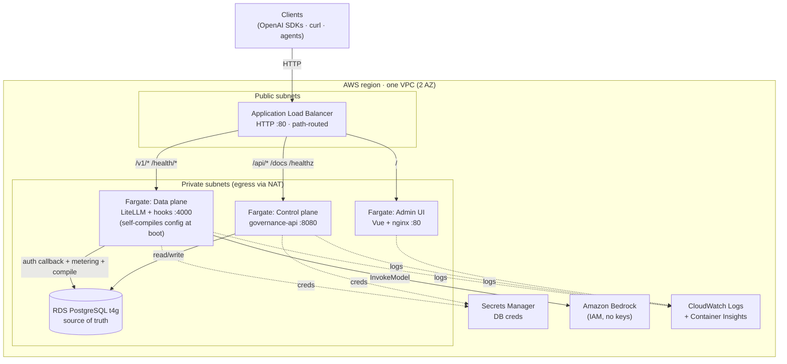
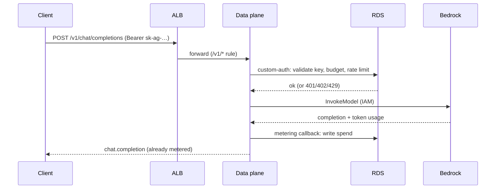
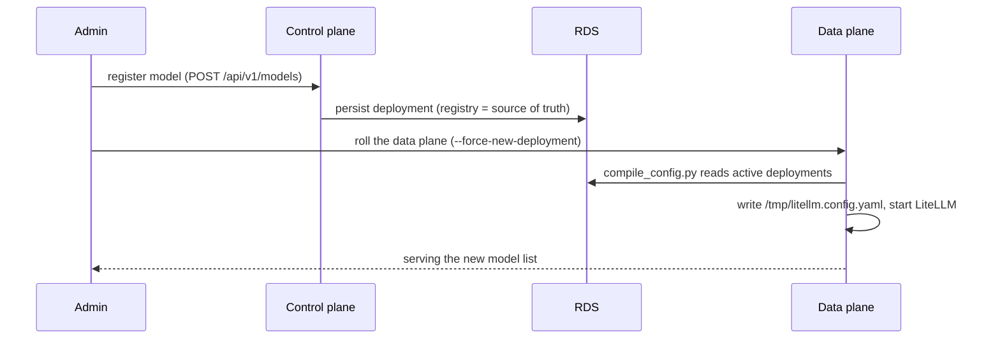

# AI Gateway — AWS Deployment (CDK)

> **Status:** Draft v2
> **Author:** Platform team
> **Related:** [`system-design.md`](./system-design.md) · [`runbook.md`](./runbook.md) · [`deployment-and-gtm.md`](./deployment-and-gtm.md) · CDK app in [`../ai-gateway-stack/`](../ai-gateway-stack/)
>
> **Stack decisions:** Infra-as-code **AWS CDK (TypeScript)**; compute **ECS Fargate**; datastore **RDS PostgreSQL (small `t4g`)** in Phase 1; **no shared filesystem** — the data plane **self-compiles** its LiteLLM config from the DB at boot; ingress **ALB (path-routed)**; providers via **Amazon Bedrock (IAM)** by default. Delivered **in phases**: Phase 1 is a simple, working, single-stack deploy; Phases 2–3 add HA, scale, security, multi-tenancy and CI/CD.

This document describes how the AI Gateway — the two-plane system in
[`system-design.md`](./system-design.md) — is deployed to AWS with the CDK app in
[`../ai-gateway-stack/`](../ai-gateway-stack/): the architecture, tech-stack
choices and why, the design logic, the flows, a **phased rollout with an
implementation plan**, and **what to watch when running this as a SaaS product**.

It draws on two references:
[`cdk-playground/LiteLLM-gateway-stack-1`](https://github.com/yennanliu/cdk-playground/tree/main/LiteLLM-gateway-stack-1)
(single-stack, phased CDK; versioned resource names) and
[`terraform-aws-litellm`](https://github.com/yennanliu/terraform-aws-litellm)
(path-based ALB routing splitting data plane / management / UI). Both deploy
*stock* LiteLLM; our design additionally deploys **our control plane** and keeps
the invariant that **our database — not LiteLLM's — is the source of truth**.

---

## Table of Contents

1. [What we are deploying](#1-what-we-are-deploying)
2. [Design principles](#2-design-principles)
3. [Tech stack & why](#3-tech-stack--why)
4. [From on-prem to AWS: component mapping](#4-from-on-prem-to-aws-component-mapping)
5. [Reference architecture (Phase 1)](#5-reference-architecture-phase-1)
6. [Request & config flows](#6-request--config-flows)
7. [Config propagation without a shared filesystem](#7-config-propagation-without-a-shared-filesystem)
8. [Phased rollout](#8-phased-rollout)
9. [Implementation plan](#9-implementation-plan)
10. [Running this as a SaaS product](#10-running-this-as-a-saas-product)
11. [Security](#11-security)
12. [Cost](#12-cost)
13. [Deploy & operate](#13-deploy--operate)
14. [Open decisions](#14-open-decisions)

---

## 1. What we are deploying

The gateway is a deliberate **two-plane split** (`system-design.md` §2). AWS runs
**both** planes plus what they depend on:

- **Control plane** — `governance-api` (FastAPI): orgs, teams, users, virtual
  keys, model registry, budgets, usage/billing, RBAC, audit. Also *compiles* the
  LiteLLM config from the registry.
- **Data plane** — LiteLLM Proxy + our `aigw-hooks`: the OpenAI-compatible
  `/v1/*` surface, provider adapters, routing/fallback. Authenticates every
  request by calling **back** into the control-plane DB (custom-auth hook) and
  meters via a success callback.
- **Admin UI** — the Vue SPA (admin + self-serve), served by nginx.
- **Shared datastore** — the single source of truth for keys and spend.

> **The invariant that shapes everything (`system-design.md` §4):** our DB is the
> source of truth for virtual keys and spend — *not* LiteLLM's own key store. On
> AWS this has one hard consequence: **SQLite is off the table**, because it can't
> be shared across Fargate tasks on different hosts. Phase 1 therefore uses
> managed Postgres (a small RDS instance) from day one.

---

## 2. Design principles

1. **Mirror the local topology.** docker-compose already defines the services,
   ports, and env contract; the AWS design lifts that onto managed services with
   the same containers and the same env vars.
2. **Keep the DB the source of truth.** No dependency on LiteLLM's key store.
   Both planes point `AIGW_DATABASE_URL` at the same RDS instance.
3. **Stateless compute, managed state.** Every Fargate task is disposable; the
   only durable state is RDS (keys/spend/audit) + Secrets Manager (credentials).
4. **No shared filesystem in Phase 1.** The data plane self-generates its config
   from the DB at boot into container-local storage (see §7) — the simplest thing
   that works, and it makes a data-plane roll the single mechanism for picking up
   registry changes.
5. **Local-first parity.** The same Dockerfiles build the AWS images.
6. **Phase for a working baseline first**, then layer scale/security/CI-CD without
   re-architecting.
7. **Cheap, zero-key demo path.** Default provider access is **Bedrock via IAM**.

---

## 3. Tech stack & why

| Choice | Why | Alternatives |
|---|---|---|
| **AWS CDK (TypeScript)** | Typed, composable infra; reuses the repo's CDK scaffold across phases as constructs/stacks. | Terraform (`terraform-aws-litellm`) — fine, but CDK keeps one TS toolchain. |
| **ECS Fargate** | Serverless containers — no nodes to patch; per-service scaling; runs our Docker images unchanged. | EKS (Phase 3 alternative, reuses the Helm chart); App Runner (too rigid for a 3-service topology). |
| **RDS PostgreSQL, single `t4g` instance** *(Phase 1)* | The **simplest, cheapest** shared source of truth; the control plane is not the hot path, so a burstable Graviton micro is plenty. Same Postgres the app already supports. | Aurora Serverless v2 (auto-scaling, Multi-AZ — **Phase 2**); SQLite (**impossible** to share across tasks). |
| **No shared FS — data plane self-compiles** *(Phase 1)* | Removes EFS mount targets / access points / NFS security groups **and** S3 wiring. The data plane already has DB access, so it compiles the config from the DB at boot into `/tmp` (see §7). Rolling the data plane = pick up registry changes. | EFS (v1 of this doc — more moving parts); S3 + fetch shim (**Phase 2**, for a versioned audit trail + live reload). |
| **ALB, path-routed** | One public entrypoint; L7 rules split `/` (UI), `/api/*` (control), `/v1/*` (data). Health checks per plane. | Three ALBs (costly); API Gateway (extra hop). Pattern from `terraform-aws-litellm`. |
| **Secrets Manager** | DB credentials auto-generated + injected as ECS secrets; provider keys (non-Bedrock) referenced by `os.environ/<ref>` exactly as the compiler emits. | SSM Parameter Store (no rotation, no RDS integration). |
| **Bedrock via IAM** | Zero-key provider access: the data-plane task role gets `bedrock:InvokeModel`. | OpenAI/Anthropic keys in Secrets Manager (supported; not zero-setup). |
| **CDK image assets** *(Phase 1)* | `cdk deploy` builds the three Dockerfiles → ECR in one command. | CI-built, tagged ECR images (**Phase 2** — reproducible, faster). |

**Packaging note.** `psycopg` (the Postgres driver) is a **base** dependency of
`governance-api` so both images and every `uv run` have it; SQLite stays the
zero-config local default. (It was previously an optional extra that no image
installed — which would have broken any Postgres deploy.)

---

## 4. From on-prem to AWS: component mapping

| Local / docker-compose | AWS (Phase 1) | Env contract |
|---|---|---|
| `governance-api` `:8080` | Fargate service (control plane) | `AIGW_DATABASE_URL`, `AIGW_LITELLM_CONFIG_PATH` |
| `litellm-proxy` `:4000` | Fargate service (data plane) | `AIGW_DATABASE_URL`, `AIGW_LITELLM_CONFIG` |
| `admin-ui` nginx `:80` | Fargate service (UI) | — (ALB routes `/api` to control plane) |
| Shared `/data` volume | **gone** — data plane self-compiles config to `/tmp` | `AIGW_LITELLM_CONFIG_PATH` |
| SQLite file (default) | **RDS PostgreSQL (`t4g`)** | `postgresql+psycopg://…` |
| Redis (`--profile scale`) | ElastiCache (**Phase 2**) | `AIGW_REDIS_URL` |
| `stub-provider` `:9099` | Amazon Bedrock via IAM | — |
| `seed` one-shot | ECS `run-task` (one-shot) | `AIGW_DATABASE_URL` |
| Host ports | ALB path routing | — |
| `.env` secrets | Secrets Manager | injected as ECS secrets |

---

## 5. Reference architecture (Phase 1)



**Key points**

- **One ALB, three target groups.** Default → UI; `/api/*`, `/healthz`, `/readyz`,
  `/docs`, `/openapi.json` → control plane; `/v1/*`, `/health/*`, `/models`,
  `/chat/*`, `/embeddings` → data plane. Prefixes are disjoint (`/api/v1/*` vs
  `/v1/*`), so no rule collides. (ALB caps a condition at 5 path values, so each
  rule stays ≤ 5.)
- **Health checks per plane.** UI `/`; control plane `/healthz`; data plane
  `/health/liveliness`. The data plane comes up healthy even with an empty model
  list (the fallback config wires `custom_auth`).
- **DB URL assembly.** Only username/password are secret (ECS secrets); host/
  port/name are plain env; a shell wrapper builds `AIGW_DATABASE_URL` at startup —
  no secret is baked into a task definition or image.
- **Single stack, versioned name.** `-c version=v2` stands up a fresh, cleanly
  named stack (own DB/ALB/cluster) for blue/green-style cutovers and easy teardown.

---

## 6. Request & config flows

### 6.1 A governed inference request



### 6.2 Config lifecycle (registry → running proxy)



---

## 7. Config propagation without a shared filesystem

The registry (DB) is the source of truth; the LiteLLM YAML is a **derived
artifact** (`services/config_compiler.py`). On one host that's a file on a shared
volume; across Fargate tasks it needs handling. Phase 1 removes shared storage
entirely:

- **Phase 1 — self-compile at boot ("instance memory").** The data-plane
  container, before launching LiteLLM, runs
  [`scripts/compile_config.py`](../scripts/compile_config.py): it reads the active
  model deployments from the shared DB and writes `/tmp/litellm.config.yaml`
  (container-local), then the entrypoint starts the proxy. The data-plane image
  already has DB access (custom-auth) and the `governance_api` package, so this
  needs **no new AWS resource** — no EFS, no S3, no bucket, no extra IAM. Trade-off:
  the config is read once at boot, so **a registry change is picked up on the next
  data-plane deployment** (`aws ecs update-service --force-new-deployment`). There
  is no separate "compile" step — the roll *is* the recompile.
- **Phase 2 — S3 + live reload.** For a versioned config audit trail and reload
  without a full roll: the control plane's `POST /api/v1/config/compile` writes the
  YAML to a versioned **S3** bucket; an S3 event (or the existing
  `POST /config/reload`) triggers a small **Lambda** that either forces a rolling
  data-plane deploy or signals the proxies to re-fetch and reload.

---

## 8. Phased rollout

### Phase 1 — MVP: simple, working, single stack ✅ (implemented)

**Goal:** one `cdk deploy` brings up both planes + UI and serves a governed request.

- 1 VPC (2 AZ, 1 NAT), public + private-with-egress subnets.
- **Single RDS PostgreSQL `t4g.micro`**, gp3 20 GB, single-AZ, encrypted, private.
- **No shared filesystem** — data plane self-compiles config from the DB at boot.
- ECS Fargate cluster (Container Insights on); 3 services built from the repo
  Dockerfiles as CDK assets (`linux/amd64`).
- Public ALB, HTTP :80, path-routed to 3 target groups; per-plane health checks.
- Secrets Manager for DB creds; data-plane task role can invoke Bedrock.
- CloudWatch logs; circuit-breaker rollback + `minHealthyPercent: 100` on deploys.
- Optional one-shot **seed** task (demo org/keys/models in the DB).

**Known limits (by design):** HTTP only (no TLS); single NAT; no Redis (rate
limits per-task/approximate); config reload needs a data-plane roll; single-AZ
RDS with `DESTROY` removal (dev); public exposure with only the app's dev auth
shim (acceptable for now — see §11).

### Phase 2 — Production hardening

**Goal:** HA, secure, observable, hands-off deploys.

- **TLS & DNS:** ACM cert + Route 53 record; HTTPS listener with HTTP→HTTPS
  redirect; **WAF** (managed rules + rate-based) on the ALB.
- **HA data:** migrate RDS → **Aurora PostgreSQL Serverless v2** (or Multi-AZ RDS
  + read replica); backups + `SNAPSHOT`/`RETAIN` removal; **RDS Proxy** to pool
  connections; Multi-AZ NAT.
- **Redis:** ElastiCache (encrypted, Multi-AZ) → `AIGW_REDIS_URL` for **exact,
  cluster-wide** rate limits and response caching.
- **Autoscaling:** data plane target-tracking on CPU/RPS (min 2 → max N); control
  plane min 2.
- **Config reload:** S3-backed config + reload Lambda (see §7).
- **Image pipeline:** CI builds + tags ECR images; CDK references immutable tags
  (no build on deploy → faster, reproducible).
- **Network hardening:** VPC endpoints (ECR, S3, Secrets Manager, CloudWatch,
  Bedrock) to cut NAT cost; least-privilege per-service task roles; secret rotation.
- **Auth:** put a real IdP / OIDC in front of the control plane + UI (the app's
  SSO seam lands here); WAF allowlists for admin surfaces.
- **Observability:** CloudWatch dashboards + alarms → SNS; OTel collector sidecar →
  the org's tracing backend (OTel/Prometheus/Langfuse per `system-design.md`).
- **Stack split:** Network / Data / Services / Edge stacks for blast-radius isolation.

### Phase 3 — Enterprise, scale-out & multi-tenant SaaS

**Goal:** multi-region, turnkey delivery, tenant isolation (see §10).

- **CI/CD:** CDK Pipelines (self-mutating); **blue/green** data-plane deploys via
  CodeDeploy; `cdk diff` gates.
- **Multi-region:** Aurora Global Database; Route 53 latency/failover; active-passive
  DR with documented RTO/RPO.
- **Multi-tenancy:** tenant model-name namespacing in the compiled config, or
  per-tenant proxy pools; per-tenant secrets isolation; onboarding automation (§10).
- **Connectivity:** PrivateLink ingress for customer VPCs; controlled provider egress.
- **EKS alternative track:** reuse the Helm chart (`deploy/helm/ai-gateway/`) on EKS
  (proxy autoscales via HPA) — same images, same env contract.
- **Compliance:** KMS CMKs; GuardDuty, Security Hub, AWS Config; budgets + cost
  anomaly detection; audit-log export to S3 (Object Lock).

---

## 9. Implementation plan

Concrete, sequenced work per phase. Each item is a shippable step.

### Phase 1 (done) — verify & operate

1. ✅ CDK stack: VPC → RDS `t4g` → 3 Fargate services → ALB (this repo).
2. ✅ `psycopg` as a base dep; `scripts/compile_config.py` for boot-time compile.
3. `npx cdk bootstrap` (once per account/region), then `cdk deploy`.
4. Enable Bedrock model access; register a model; roll the data plane; smoke-test
   `/v1/chat/completions` with a virtual key.
5. Add the CDK CI workflow (build + synth + test on PRs) — see §13 / `.github`.

### Phase 2 — hardening (suggested order)

1. **CI image pipeline:** GitHub Actions builds `control-plane`/`data-plane`/
   `admin-ui` images, pushes to ECR with an immutable tag; parametrize the stack to
   consume `-c imageTag=...` instead of `fromAsset`.
2. **TLS + DNS:** add `domainName`/`hostedZoneId` context; ACM cert; HTTPS listener
   + HTTP→HTTPS redirect; attach WAF web ACL.
3. **Data HA:** swap `DatabaseInstance` → Aurora Serverless v2 (or Multi-AZ);
   introduce RDS Proxy; set `SNAPSHOT` removal + backups.
4. **Redis:** add ElastiCache; set `AIGW_REDIS_URL` on both planes.
5. **Autoscaling:** `service.autoScaleTaskCount` + target tracking on CPU/RPS.
6. **Config reload:** S3 bucket + control-plane write-to-S3 + reload Lambda; data
   plane fetches from S3 (fall back to self-compile).
7. **Network + IAM hardening:** VPC endpoints; scope task-role policies; secret
   rotation; auth/IdP in front of admin surfaces.
8. **Observability:** dashboards, alarms → SNS, OTel sidecar.
9. **Stack split:** refactor into Network/Data/Services/Edge stacks.

### Phase 3 — enterprise / SaaS

1. **CDK Pipelines** with per-environment stages (dev → stage → prod), manual
   approval + `cdk diff` gate; blue/green data-plane via CodeDeploy.
2. **Multi-tenancy** (pick a model from §10): implement config namespacing or
   per-tenant proxy pools; per-tenant secret injection.
3. **Onboarding automation:** signup → control-plane org creation → optional
   dedicated stack (`-c appName=<tenant>`).
4. **Multi-region + DR:** Aurora Global DB; Route 53 routing; failover runbook.
5. **Compliance & governance:** KMS CMKs, GuardDuty/Security Hub/Config, audit
   export, cost controls.

---

## 10. Running this as a SaaS product

If the goal is to **sell** this gateway as a hosted product, the deployment above
is the starting point, but tenancy, isolation, and lifecycle need explicit design.
Key things to note:

**Tenancy model — decide first.** The product already models
`org › team › user › key` (`system-design.md`), so an **org = a tenant**. Two
hosting shapes:

- **Pooled (shared fleet):** one control plane + one data-plane fleet + one DB
  serve all tenants. Cheapest, simplest to operate; the default. Isolation is
  logical (every row is scoped by `org_id`; keys are scoped to their org).
- **Siloed (per-tenant stack):** deploy a stack per tenant with
  `-c appName=<tenant> -c version=v1`. Strong isolation and per-tenant blast
  radius/SLA; higher cost and ops. Offer for enterprise/regulated tenants.

**⚠️ The model-naming isolation gotcha (from self-compile).** The Phase 1 data
plane compiles a **whole-fleet** config across *all* orgs (`compile_config.py`
with no `AIGW_ORG_ID`). Two tenants that both register a public name like
`gpt-4o` collide in one `model_list`, and LiteLLM would load-balance across both
deployments — a **cross-tenant routing/leak risk**. Before going multi-tenant,
either:

- **namespace** public names in the compiled config (e.g. `org_<id>__gpt-4o`) and
  have the data plane resolve the caller's org before routing; or
- run **per-tenant proxy pools** (siloed data plane); or
- restrict Phase 1 pooled mode to **one org per deployment** (set `AIGW_ORG_ID`).

Key scoping (`allowed_models`) already limits *which* names a key may call, but it
does not by itself prevent same-name collisions from routing to another tenant's
deployment. Treat this as a **must-fix before pooled multi-tenancy**.

**Provider credentials (BYOK).** Tenants bring their own provider keys. Store each
in Secrets Manager; the compiler emits `os.environ/<ref>`. In a pooled fleet,
every proxy task would need *every* tenant's keys as env — a scaling and
blast-radius problem. Options: per-tenant proxy pools; or a dynamic secret
resolver in the data plane that fetches the right secret per request. Bedrock-via-
IAM sidesteps this for AWS-native inference.

**Onboarding & self-serve.** Signup → create an org via the control-plane API →
issue the first admin + virtual key. Automate; keep it idempotent. For siloed
tenants, trigger a stack deploy per signup (CDK Pipelines / a provisioning queue).

**Metering, billing & quotas.** The product already meters usage → cost → invoices
and supports rate cards + budgets (`system-design.md`). For SaaS: wire invoices to
a billing provider (e.g. Stripe), enforce **per-tenant budgets** (already scoped)
and **per-tenant rate limits** — the latter needs **Redis** (Phase 2) for exact,
cluster-wide limits so one tenant can't exhaust a shared fleet (noisy neighbor).

**Data isolation & compliance.** All tenant data is `org_id`-scoped in one DB
(pooled). For regulated tenants, use siloed stacks and/or per-tenant KMS keys.
Support per-tenant data export/delete (GDPR), audit-log retention (Object Lock),
and a documented data-residency story (region pinning; multi-region in Phase 3).

**Availability & SLA.** Pooled means shared blast radius — Multi-AZ RDS/Aurora,
autoscaled stateless planes, WAF, and alarms are prerequisites for any SLA. Track
per-tenant error budgets from the metering/usage data.

**Cost attribution.** Usage is already per-org; map it to AWS cost with tags
(per-stack for siloed, allocation tags + usage-based for pooled) to price plans
and spot unprofitable tenants.

**Auth.** Public SaaS needs real tenant auth (SSO/OIDC per the app's auth seam),
not the dev header shim. Put an IdP + WAF in front (Phase 2) before onboarding
external users.

---

## 11. Security

- **Network:** tasks + data run in **private** subnets; only the ALB is public.
  Security groups are least-open — ALB→service on the container port only;
  service→RDS `:5432`. RDS egress is closed.
- **Public exposure (Phase 1):** the ALB is internet-facing over **HTTP**, and the
  app currently uses a **dev header auth shim** (no SSO yet). This is **acceptable
  for a trial/demo** and is the current default. Before onboarding real users:
  add TLS + WAF and a real IdP (Phase 2), or restrict the ALB to an IP allowlist /
  make it internal. Don't put production tenant data behind the dev shim.
- **Secrets:** DB credentials auto-generated in Secrets Manager, injected as ECS
  secrets — never in plaintext env, task defs, or images. Provider keys (when
  used) live in Secrets Manager and surface only as `os.environ/<ref>`, so
  **plaintext credentials never touch the compiled YAML**.
- **Providers:** Bedrock via IAM removes long-lived provider keys entirely.
- **At rest / in transit:** RDS encrypted; add TLS at the edge in Phase 2.

---

## 12. Cost

Rough Phase 1 order-of-magnitude (light traffic; verify with the pricing
calculator):

| Item | Driver | Notes |
|---|---|---|
| Fargate (3 small services) | vCPU/GB-hours | Biggest steady cost; scale to 1 task each when idle |
| RDS `t4g.micro` (single-AZ) | instance-hour + 20 GB gp3 | Cheapest simple Postgres; stop/start for dev |
| NAT Gateway | hourly + per-GB | Single NAT in Phase 1; VPC endpoints (Phase 2) cut this |
| ALB | hourly + LCU | One ALB for all three services |
| CloudWatch / Secrets | logs GB + secrets | Minor |

**Levers:** single NAT (done); no EFS (removed); RDS `t4g` instead of Aurora's ACU
floor; scale services to 1 task off-hours; VPC endpoints in Phase 2.

---

## 13. Deploy & operate

Commands and the "make it serve a request" steps are in the CDK project README:
[`../ai-gateway-stack/README.md`](../ai-gateway-stack/README.md). In short:

```bash
cd ai-gateway-stack
npm install && npx cdk bootstrap        # once per account/region
npx cdk deploy -c appName=ai-gateway -c version=v1
# → outputs: AdminUiUrl, ControlPlaneUrl, GatewayUrl, SeedTask*
```

Then register a Bedrock model → roll the data plane
(`aws ecs update-service … --force-new-deployment`, which recompiles the config) →
call `{GatewayUrl}/chat/completions` with a virtual key. Teardown: `npx cdk destroy
-c version=v1`.

**CI.** `.github/workflows/cdk-infra.yml` runs on changes under `ai-gateway-stack/`:
`npm ci` → `tsc` build → `jest`. The Jest tests synthesize the CloudFormation
template in-process (`Template.fromStack`), which validates types and stack shape
**without** AWS creds, Docker, or building the `fromAsset` images (those are
deferred to `cdk deploy`). This catches type errors and stack-shape regressions on
every PR while staying fast.

---

## 14. Open decisions

- **RDS vs Aurora.** Phase 1 uses a single `t4g` RDS instance for cost/simplicity;
  Phase 2 moves to Aurora Serverless v2 (or Multi-AZ RDS) + RDS Proxy for HA.
- **Config propagation.** Self-compile at boot (Phase 1) vs S3 + reload-Lambda
  (Phase 2). S3 wins once a versioned audit trail / live reload is needed.
- **Multi-tenant model naming.** Must resolve the same-public-name collision (§10)
  before pooled multi-tenancy — namespacing vs per-tenant proxy pools.
- **Public exposure.** Fine for a trial now; gate behind TLS + WAF + IdP before
  onboarding external tenants.
- **CDK asset builds vs CI images.** Phase 1 builds on `deploy`; Phase 2 moves to
  CI-built immutable tags (faster deploys; no Docker/`linux/amd64` cross-build on a
  dev laptop).
