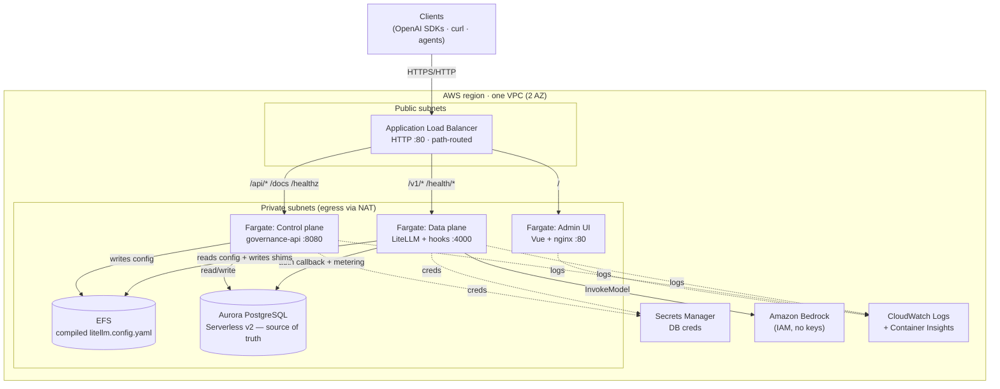
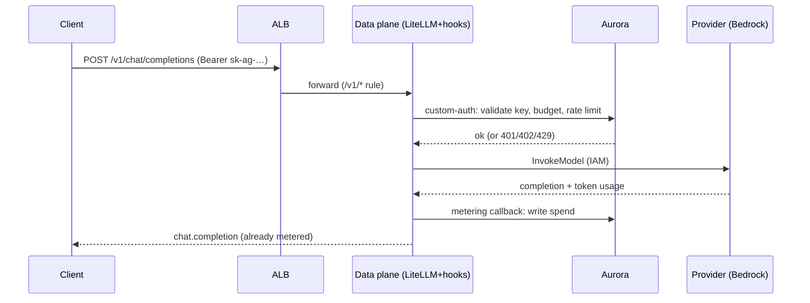
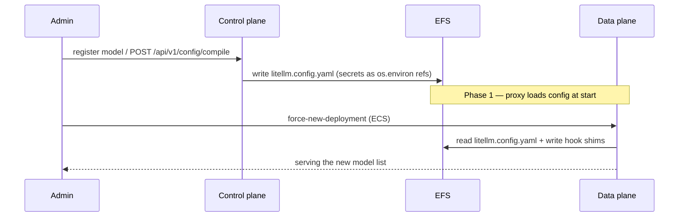

# AI Gateway — AWS Deployment (CDK)

> **Status:** Draft v1
> **Author:** Platform team
> **Related:** [`system-design.md`](./system-design.md) · [`runbook.md`](./runbook.md) · [`deployment-and-gtm.md`](./deployment-and-gtm.md) · CDK app in [`../ai-gateway-stack/`](../ai-gateway-stack/)
>
> **Stack decisions:** Infra-as-code **AWS CDK (TypeScript)**; compute **ECS Fargate**; datastore **Aurora PostgreSQL Serverless v2**; shared config **EFS**; ingress **ALB (path-routed)**; providers via **Amazon Bedrock (IAM)** by default. Delivered **in phases** — Phase 1 is a simple, working, single-stack deploy; Phases 2–3 add HA, scale, security, and CI/CD.

This document describes how the AI Gateway — the two-plane system specified in
[`system-design.md`](./system-design.md) — is deployed to AWS with the CDK app in
[`../ai-gateway-stack/`](../ai-gateway-stack/). It covers the architecture, the
tech-stack choices and why, the design logic, the request/data flows, and a
phased rollout plan.

It draws on two references:
[`cdk-playground/LiteLLM-gateway-stack-1`](https://github.com/yennanliu/cdk-playground/tree/main/LiteLLM-gateway-stack-1)
(single-stack CDK: VPC → Aurora Serverless v2 → Fargate + ALB, phased, versioned
resource names) and
[`terraform-aws-litellm`](https://github.com/yennanliu/terraform-aws-litellm)
(path-based ALB routing that splits the LLM data plane, the management backend,
and the UI onto separate Fargate services). Both deploy *stock* LiteLLM; our
design additionally deploys **our control plane** and preserves the invariant
that **our database — not LiteLLM's — is the source of truth**.

---

## Table of Contents

1. [What we are deploying](#1-what-we-are-deploying)
2. [Design principles](#2-design-principles)
3. [Tech stack & why](#3-tech-stack--why)
4. [From on-prem to AWS: component mapping](#4-from-on-prem-to-aws-component-mapping)
5. [Reference architecture (Phase 1)](#5-reference-architecture-phase-1)
6. [Request & data flows](#6-request--data-flows)
7. [The hard part: config propagation](#7-the-hard-part-config-propagation)
8. [Phased rollout](#8-phased-rollout)
9. [Security](#9-security)
10. [Cost](#10-cost)
11. [Deploy & operate](#11-deploy--operate)
12. [Open decisions](#12-open-decisions)

---

## 1. What we are deploying

The gateway is a deliberate **two-plane split** (see `system-design.md` §2). AWS
must run **both** planes plus everything they depend on:

- **Control plane** — `governance-api` (FastAPI): orgs, teams, users, virtual
  keys, model registry, budgets, usage/billing, RBAC, audit. It also *compiles*
  the LiteLLM config from the registry.
- **Data plane** — LiteLLM Proxy + our `aigw-hooks` package: the OpenAI-compatible
  `/v1/*` surface, provider adapters, routing/fallback. It authenticates every
  request by calling **back** into the control-plane DB (custom-auth hook) and
  meters via a success callback.
- **Admin UI** — the Vue SPA (admin console + self-serve), served by nginx.
- **Shared datastore** — the single source of truth for keys and spend.
- **Shared compiled config** — the derived LiteLLM YAML the data plane loads.

> **The invariant that shapes everything (`system-design.md` §4):** our SQLite/
> Postgres DB is the source of truth for virtual keys and spend — *not* LiteLLM's
> own key store. On AWS this has one hard consequence: **SQLite is off the table**,
> because it cannot be shared across Fargate tasks on different hosts. Phase 1
> therefore uses managed Postgres from day one. Everything else in the local
> stack maps across cleanly.

---

## 2. Design principles

1. **Mirror the local topology, don't reinvent it.** The docker-compose stack
   (`deploy/docker-compose/`) already defines the services, ports, env vars, and
   the shared `/data` volume. The AWS design is a faithful lift of that topology
   onto managed services — same containers, same env contract, same config file
   on a shared volume (now EFS instead of a Docker volume).
2. **Keep the DB the source of truth.** No dependency on LiteLLM's Prisma/Postgres
   key store. Both planes point `AIGW_DATABASE_URL` at the same Aurora cluster.
3. **Stateless compute, managed state.** Every Fargate task is disposable; all
   durable state lives in Aurora (keys/spend/audit), EFS (compiled config), and
   Secrets Manager (credentials). This is what makes horizontal scaling and
   rollbacks safe.
4. **Local-first parity.** The same Dockerfiles used locally build the AWS
   images (as CDK assets in Phase 1). No AWS-only code paths in the app.
5. **Phase for a working baseline first.** Phase 1 optimizes for *simple and
   correct end-to-end*, not for HA. Scale, TLS, caching, and CI/CD are layered on
   in later phases without re-architecting.
6. **Cheap, zero-key demo path.** Default provider access is **Amazon Bedrock via
   IAM** — no provider API keys to manage, native to the account.

---

## 3. Tech stack & why

| Choice | Why | Alternatives considered |
|---|---|---|
| **AWS CDK (TypeScript)** | Typed, composable infra; the repo already has a CDK scaffold; reuse across phases as constructs/stacks. | Terraform (see `terraform-aws-litellm`) — great, but CDK keeps infra in one TS toolchain and matches the existing scaffold. |
| **ECS Fargate** | Serverless containers — no EC2/nodes to patch; scales per-service; runs our existing Docker images unchanged. | EKS (more power, more ops — offered as a Phase 3 alternative reusing the Helm chart); App Runner (too opinionated for a 3-service + shared-volume topology). |
| **Aurora PostgreSQL Serverless v2** | The shared source of truth. Serverless v2 auto-scales ACUs, needs no instance sizing, is Multi-AZ-capable, and speaks the same Postgres the app already supports (`AIGW_DATABASE_URL`). | RDS Postgres (fine, cheaper floor, but manual sizing); SQLite (**impossible** to share across tasks). |
| **EFS (shared config volume)** | The control plane writes the compiled `litellm.config.yaml`; the data plane reads it — exactly the docker-compose `/data` volume. NFS semantics mean no app change. | S3 (better long-term — Phase 2 — but needs a fetch/reload shim); baking config into the image (loses the "registry is source of truth, config is derived" property). |
| **Application Load Balancer, path-routed** | One public entrypoint; L7 rules split `/` (UI), `/api/*` (control), `/v1/*` (data) onto three target groups. Health checks per plane. | Three ALBs (costly); API Gateway (extra hop, no gain for OpenAI-shaped traffic). Pattern borrowed from `terraform-aws-litellm`. |
| **Secrets Manager** | DB credentials auto-generated and injected as ECS secrets; provider keys (when not using Bedrock) referenced by `os.environ/<ref>` exactly as the config compiler emits. | SSM Parameter Store (fine for non-rotating values; Secrets Manager gives rotation + RDS integration). |
| **Amazon Bedrock via IAM** | Zero-key provider access on AWS: the data-plane task role gets `bedrock:InvokeModel`. Register a Bedrock model → it just works. | OpenAI/Anthropic API keys in Secrets Manager (fully supported; just not zero-setup). |
| **CDK container-image assets (Phase 1)** | `cdk deploy` builds the three Dockerfiles and pushes to ECR — one command, no separate pipeline. | CI-built, tagged ECR images (Phase 2 — reproducible, faster deploys). |

---

## 4. From on-prem to AWS: component mapping

Every local component has a managed AWS counterpart; the app is unchanged.

| Local / docker-compose | AWS (Phase 1) | Env contract |
|---|---|---|
| `governance-api` container `:8080` | Fargate service (control plane) | `AIGW_DATABASE_URL`, `AIGW_LITELLM_CONFIG_PATH` |
| `litellm-proxy` container `:4000` | Fargate service (data plane) | `AIGW_DATABASE_URL`, `AIGW_LITELLM_CONFIG` |
| `admin-ui` nginx `:80` | Fargate service (UI) | — (ALB routes `/api` to control plane) |
| Shared `/data` volume | EFS access point at `/data` | compiled `litellm.config.yaml` + hook shims |
| SQLite file (default) | **Aurora PostgreSQL Serverless v2** | `postgresql+psycopg://…` |
| Postgres (`--profile scale`) | Aurora (same) | — |
| Redis (`--profile scale`) | ElastiCache (**Phase 2**) | `AIGW_REDIS_URL` |
| `stub-provider` `:9099` | Amazon Bedrock via IAM (or add the stub as a 4th service) | — |
| `seed` one-shot | ECS `run-task` (one-shot) | `AIGW_LITELLM_CONFIG_PATH`, `AIGW_STUB_URL` |
| Host ports | ALB path routing | — |
| `.env` secrets | Secrets Manager | injected as ECS secrets |

---

## 5. Reference architecture (Phase 1)



**Key points**

- **One ALB, three target groups.** Default → UI; `/api/*`, `/healthz`, `/readyz`,
  `/docs`, `/openapi.json` → control plane; `/v1/*`, `/health/*`, `/models`,
  `/chat/*`, `/embeddings` → data plane. The prefixes are disjoint (`/api/v1/*`
  for control, `/v1/*` for data), so no rule collides.
- **Health checks per plane.** UI `/`; control plane `/healthz`; data plane
  `/health/liveliness` (LiteLLM's unauthenticated probe). The data plane starts
  healthy even with an empty model list (the fallback config template still wires
  `custom_auth`), so a fresh deploy is green before any model is registered.
- **DB URL assembly.** Only the DB username/password are secret. Each task gets
  them as ECS secrets plus non-sensitive `DB_HOST/DB_PORT/DB_NAME` env, and a
  shell wrapper assembles `AIGW_DATABASE_URL` at startup — no secret is ever baked
  into a task definition or image. (Pattern from the reference CDK stack.)
- **Single stack, versioned name.** `-c version=v2` stands up a fresh, cleanly
  named stack (its own DB/ALB/cluster) for blue/green-style cutovers and easy
  teardown.

---

## 6. Request & data flows

### 6.1 A governed inference request



### 6.2 Config lifecycle (registry → running proxy)



---

## 7. The hard part: config propagation

The registry (DB) is the source of truth; the LiteLLM YAML is a **derived
artifact** (`services/config_compiler.py`). On a single host that's a file on a
shared volume. Across Fargate tasks it needs deliberate handling.

- **Phase 1 — EFS + redeploy.** Control plane writes `/data/litellm.config.yaml`
  on EFS; the data plane reads it at container start (the entrypoint also writes
  `hooks/auth.py` + `hooks/callbacks.py` shims next to the config). Because
  LiteLLM loads the file once at boot, **a recompile takes effect on the next
  data-plane deployment** (`--force-new-deployment`). Simple, transparent, and
  correct — the trade-off is manual/rolling reload. This is called out as the
  main Phase 1 limitation.
- **Phase 2 — automatic reload.** Move the compiled config to **S3** (versioned).
  The control plane's existing `POST /api/v1/config/reload` (today it records
  intent) triggers a small **Lambda** that runs `ecs update-service
  --force-new-deployment` on the data plane — or, better, an S3 event does. The
  data-plane container fetches the object at start (or on SIGHUP). This removes
  the manual step and keeps a versioned audit trail of every config.

---

## 8. Phased rollout

### Phase 1 — MVP: simple, working, single stack ✅ (implemented)

**Goal:** one `cdk deploy` brings up both planes + UI and serves a governed
request end to end.

- 1 VPC (2 AZ, 1 NAT GW), public + private-with-egress subnets.
- Aurora PostgreSQL Serverless v2 (0.5–2 ACU), encrypted, private.
- EFS (encrypted) + access point at `/data`, mounted into both planes.
- ECS Fargate cluster (Container Insights on); 3 services built from the repo
  Dockerfiles as CDK assets (`linux/amd64`).
- Public ALB, HTTP :80, path-routed to 3 target groups with per-plane health checks.
- Secrets Manager for DB creds; data-plane task role can invoke Bedrock.
- CloudWatch logs; circuit-breaker rollback + `minHealthyPercent: 100` on deploys.
- Optional one-shot **seed** task (demo org/keys/models).

**Known limits (by design):** HTTP only (no TLS); single NAT; no Redis (rate
limits are per-task/approximate); config reload needs a redeploy; `DESTROY`
removal on Aurora/EFS (dev).

### Phase 2 — Production hardening

**Goal:** HA, secure, observable, hands-off deploys.

- **TLS & DNS:** ACM cert + Route 53 record; HTTPS listener with HTTP→HTTPS
  redirect. **WAF** (managed rule sets + rate-based rules) on the ALB.
- **HA data:** Aurora Multi-AZ (add a reader), backups/`SNAPSHOT` removal;
  Multi-AZ NAT (one per AZ).
- **Redis:** ElastiCache (encrypted, Multi-AZ) → `AIGW_REDIS_URL` for **exact,
  cluster-wide** rate limits and response caching.
- **Autoscaling:** data plane target-tracking on CPU/RPS (min 2 → max N);
  control plane min 2.
- **Config reload:** S3-backed config + reload Lambda (see §7).
- **Image pipeline:** CI (GitHub Actions/CodeBuild) builds + tags ECR images;
  CDK references immutable tags (no build on deploy → faster, reproducible).
- **Network hardening:** VPC endpoints (ECR, S3, Secrets Manager, CloudWatch,
  Bedrock) to cut NAT cost and keep traffic private; least-privilege per-service
  task roles; EFS IAM auth; secret rotation.
- **Observability:** CloudWatch dashboards + alarms → SNS; OTel collector sidecar
  → the org's tracing backend (OTel/Prometheus/Langfuse per `system-design.md`).
- **Stack split:** Network / Data / Services / Edge stacks for blast-radius
  isolation and independent lifecycles.

### Phase 3 — Enterprise & scale-out

**Goal:** multi-region, compliance, and turnkey delivery.

- **CI/CD:** CDK Pipelines (self-mutating); **blue/green** data-plane deploys via
  CodeDeploy; automated `cdk diff` gates.
- **Multi-region:** Aurora Global Database; Route 53 latency/failover routing;
  active-passive DR with a documented RTO/RPO.
- **Isolation & connectivity:** PrivateLink ingress for customer VPCs; per-org
  network/tenant isolation options; controlled provider egress.
- **EKS alternative track:** for teams standardized on Kubernetes, reuse the
  existing Helm chart (`deploy/helm/ai-gateway/`) on EKS (proxy autoscales via
  HPA) — same images, same env contract.
- **Compliance:** KMS CMKs everywhere; GuardDuty, Security Hub, AWS Config;
  budgets + cost anomaly detection; audit-log export to S3 (Object Lock).

---

## 9. Security

- **Network:** tasks and data run in **private** subnets; only the ALB is public.
  Security groups are least-open — ALB→service on the container port only;
  service→Aurora `:5432`; service→EFS `:2049`. Aurora egress is closed.
- **Secrets:** DB credentials auto-generated in Secrets Manager and injected as
  ECS secrets; never in env plaintext, task defs, or images. Provider keys (when
  used) live in Secrets Manager and surface only as `os.environ/<ref>` — exactly
  what the config compiler emits, so **plaintext credentials never touch the
  written YAML**.
- **Providers:** Bedrock via IAM removes long-lived provider keys entirely.
- **Data at rest / in transit:** Aurora and EFS encrypted; EFS transit encryption
  on. Phase 2 adds TLS at the edge and WAF.
- **Auth note:** the app's dev auth shim (header-based `Principal`) is unchanged;
  SSO lands in the app, not the infra (`system-design.md`). Until then, do **not**
  expose the control-plane/UI publicly without an auth layer in front (Phase 2
  WAF + a real IdP).

---

## 10. Cost

Rough Phase 1 order-of-magnitude (us-east-1, light traffic; verify with the
AWS pricing calculator):

| Item | Driver | Notes |
|---|---|---|
| Fargate (3 small services) | vCPU/GB-hours | Biggest steady cost; scale to 1 task each when idle |
| Aurora Serverless v2 | ACU-hours (0.5 floor) | Scales down but not to zero in v2 |
| NAT Gateway | hourly + per-GB | Single NAT in Phase 1; VPC endpoints (Phase 2) cut this |
| ALB | hourly + LCU | One ALB for all three services |
| EFS | GB stored | Tiny (a few KB of config) |
| CloudWatch / Secrets | logs GB + secrets | Minor |

**Levers:** single NAT (done); VPC endpoints (Phase 2) to shrink NAT egress;
scale services to 1 task off-hours; Aurora min ACU 0.5.

---

## 11. Deploy & operate

Commands and the post-deploy "make it serve a request" steps live in the CDK
project README: [`../ai-gateway-stack/README.md`](../ai-gateway-stack/README.md).
In short:

```bash
cd ai-gateway-stack
npm install && npx cdk bootstrap        # once per account/region
npx cdk deploy -c appName=ai-gateway -c version=v1
# → outputs: AdminUiUrl, ControlPlaneUrl, GatewayUrl, SeedTask* 
```

Then register a Bedrock model → `POST /api/v1/config/compile` → roll the data
plane (`aws ecs update-service … --force-new-deployment`) → call
`{GatewayUrl}/chat/completions` with a virtual key. Teardown: `npx cdk destroy
-c version=v1`. Operational procedures reuse [`runbook.md`](./runbook.md).

---

## 12. Open decisions

- **Aurora vs. RDS floor cost.** Serverless v2 won't scale to zero; for
  dev/demo environments a small RDS `t4g` instance (or stop/start) may be
  cheaper. Revisit per-environment.
- **Config propagation mechanism.** EFS+redeploy (Phase 1) vs. S3+reload-Lambda
  (Phase 2) vs. wiring `config.reload` to SSM RunCommand. S3 is the leading
  candidate for the versioned audit trail.
- **Public exposure before SSO.** Until the app ships real auth, the control
  plane/UI should sit behind WAF + an IdP (Phase 2) or stay VPC-internal.
- **CDK asset builds vs. CI images.** Phase 1 builds on `deploy`; Phase 2 should
  move to CI-built immutable tags to speed deploys and decouple from a dev laptop
  (and from Docker/`linux/amd64` cross-build on Apple Silicon).
